# InvoiceFine Media Asset Center

Official branding assets, high-resolution logos, product screenshots, banners, and marketing creatives for **InvoiceFine**.

---

## 1. Logos & Brand Marks

| Asset Name | Preview | Format | Dimensions | File Path |
|---|---|---|---|---|
| **InvoiceFine Primary Logo** |  | PNG (RGBA) | 1024 × 1024 | [`assets/logo/invoicefine-logo.png`](assets/logo/invoicefine-logo.png) |
| **Square App Brand Logo** | 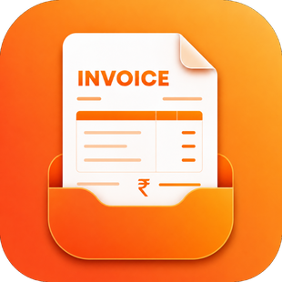 | PNG (RGBA) | 310 × 310 | [`assets/logo/square-logo.png`](assets/logo/square-logo.png) |
| **Storefront Icon Mark** |  | PNG (RGBA) | 50 × 50 | [`assets/logo/store-logo.png`](assets/logo/store-logo.png) |

---

## 2. App Icons & Favicons

| Asset Name | Preview | Format | Dimensions | File Path |
|---|---|---|---|---|
| **Application Icon (512px)** |  | PNG (RGBA) | 512 × 512 | [`assets/icons/app-icon-512.png`](assets/icons/app-icon-512.png) |
| **Application Icon (128px)** | 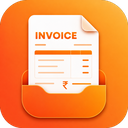 | PNG (RGBA) | 128 × 128 | [`assets/icons/app-icon-128.png`](assets/icons/app-icon-128.png) |
| **Application Icon (32px)** |  | PNG (RGBA) | 32 × 32 | [`assets/icons/app-icon-32.png`](assets/icons/app-icon-32.png) |
| **Web Favicon** | 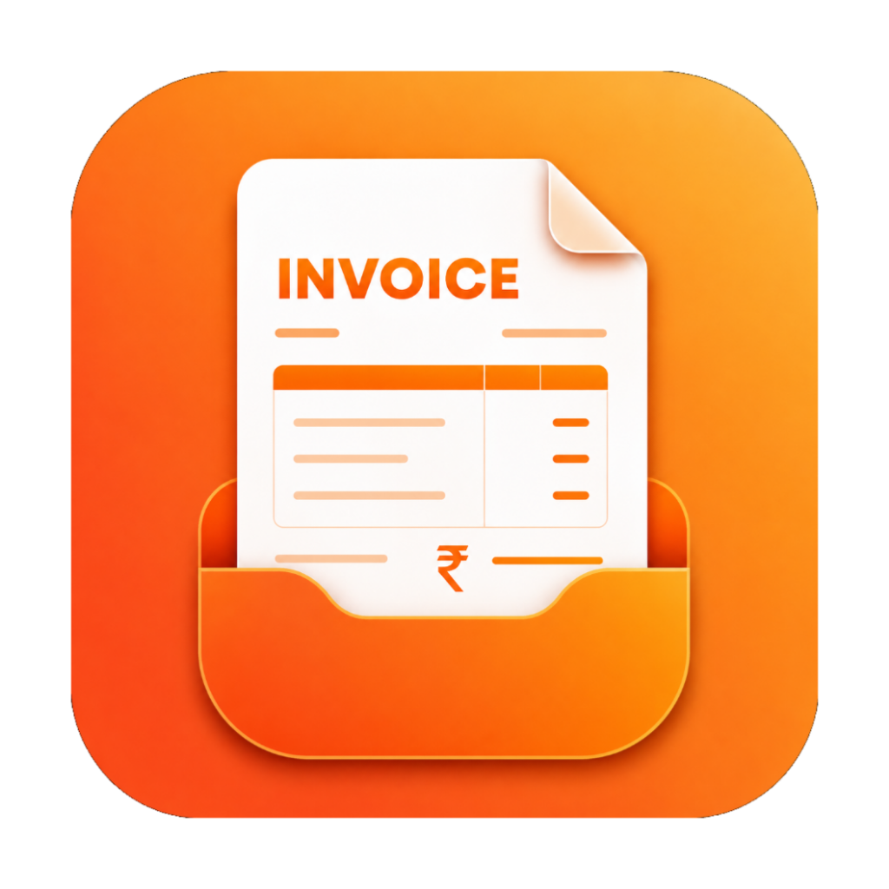 | PNG (RGBA) | 1024 × 1024 | [`assets/icons/favicon.png`](assets/icons/favicon.png) |
| **Android Adaptive Icon** | 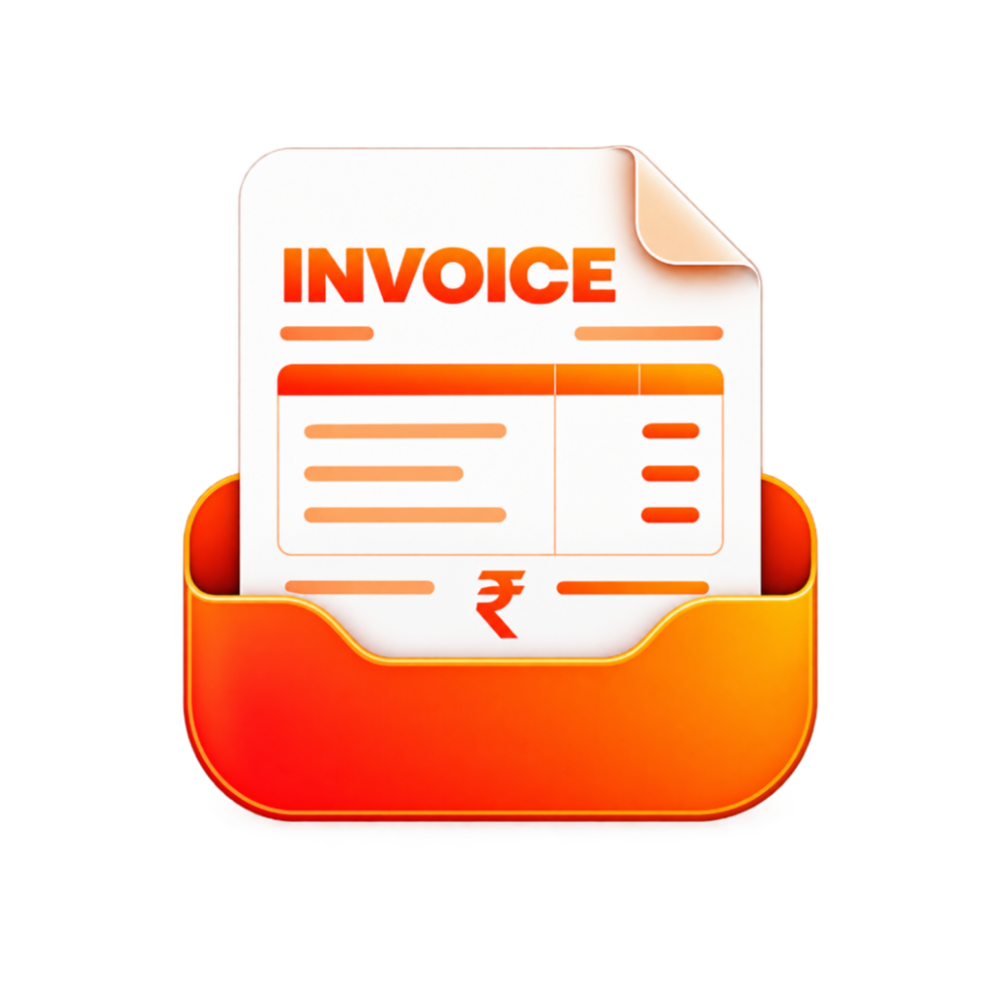 | PNG (RGBA) | 1024 × 1024 | [`assets/icons/adaptive-icon.png`](assets/icons/adaptive-icon.png) |

---

## 3. Marketing Creatives & Banners

| Asset Name | Preview | Format | Dimensions | File Path |
|---|---|---|---|---|
| **Pro Upgrade Banner** |  | PNG (RGB) | 1280 × 1280 | [`assets/marketing/pro-upgrade-banner.png`](assets/marketing/pro-upgrade-banner.png) |
| **Notification Creative** |  | PNG (RGB) | 1254 × 1254 | [`assets/marketing/notification-screen.png`](assets/marketing/notification-screen.png) |
| **Welcome Banner** |  | PNG (RGBA) | 1024 × 1536 | [`assets/marketing/welcome-screen.png`](assets/marketing/welcome-screen.png) |
| **Feature Highlight Banner** | 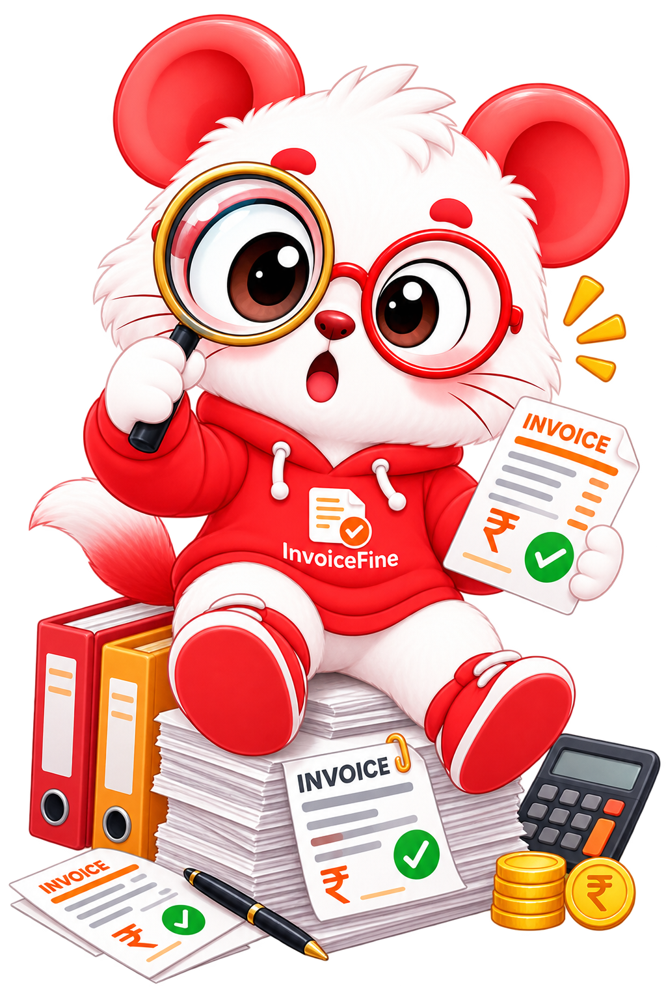 | PNG (RGBA) | 1024 × 1536 | [`assets/marketing/feature-highlight.png`](assets/marketing/feature-highlight.png) |
| **Product Introduction** | 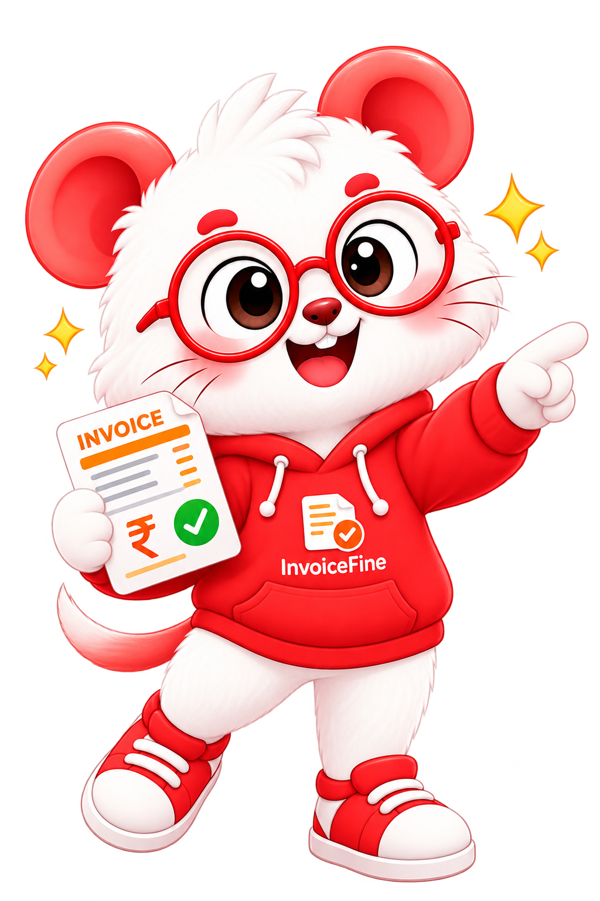 | PNG (RGBA) | 1024 × 1536 | [`assets/marketing/introduction.png`](assets/marketing/introduction.png) |
| **Ready to Start Graphic** |  | PNG (RGBA) | 1024 × 1536 | [`assets/marketing/ready-to-start.png`](assets/marketing/ready-to-start.png) |
| **Success State Creative** |  | PNG (RGBA) | 1024 × 1536 | [`assets/marketing/success-screen.png`](assets/marketing/success-screen.png) |
| **Empty State Graphic** |  | PNG (RGBA) | 1024 × 1536 | [`assets/marketing/empty-state.png`](assets/marketing/empty-state.png) |
| **No Invoices State** |  | PNG (RGBA) | 1024 × 1536 | [`assets/marketing/no-invoices-screen.png`](assets/marketing/no-invoices-screen.png) |

---

## 4. Invoice Template Samples

| Template | Preview | Format | Dimensions | File Path |
|---|---|---|---|---|
| **Classic Template** | 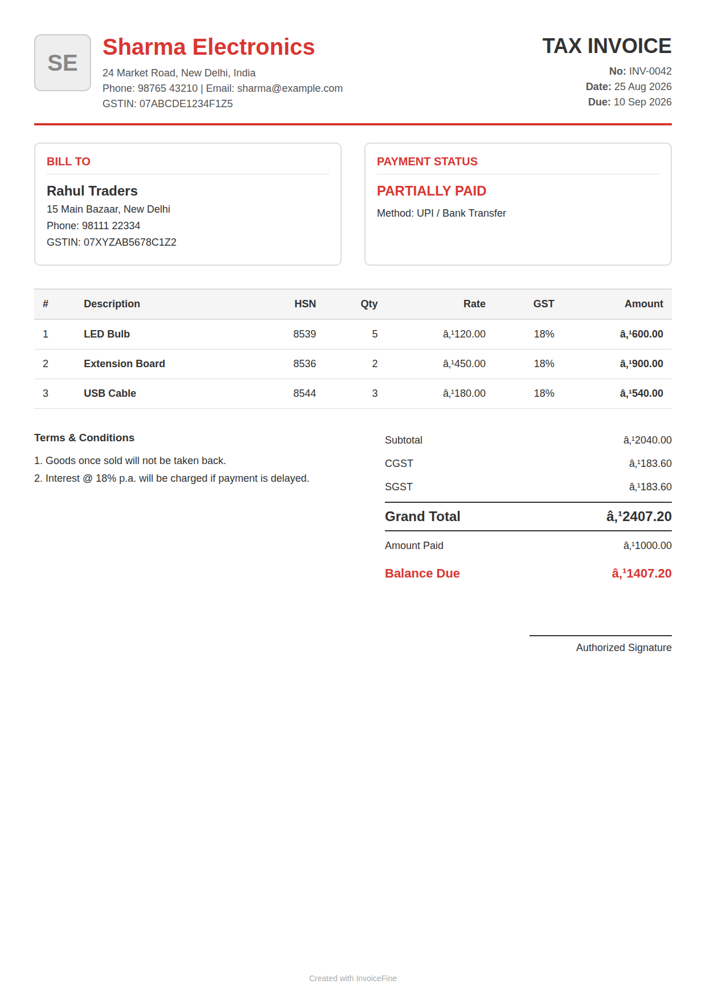 | PNG | 1240 × 1754 (A4) | [`assets/templates/classic.png`](assets/templates/classic.png) |
| **Compact Template** | 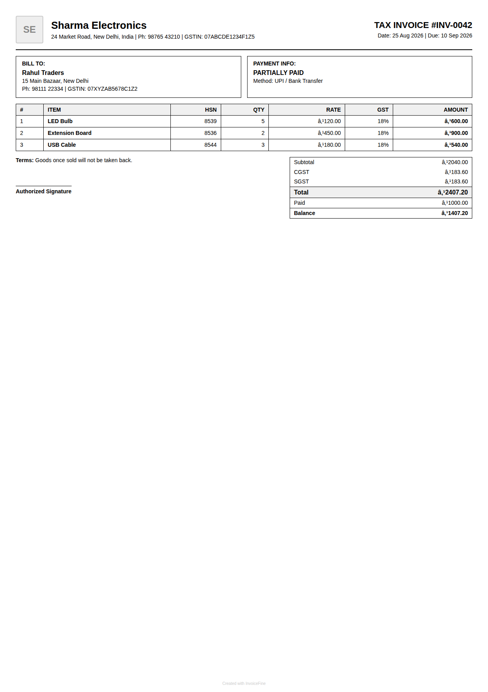 | PNG | 1240 × 1754 (A4) | [`assets/templates/compact.png`](assets/templates/compact.png) |
| **Modern Template** | 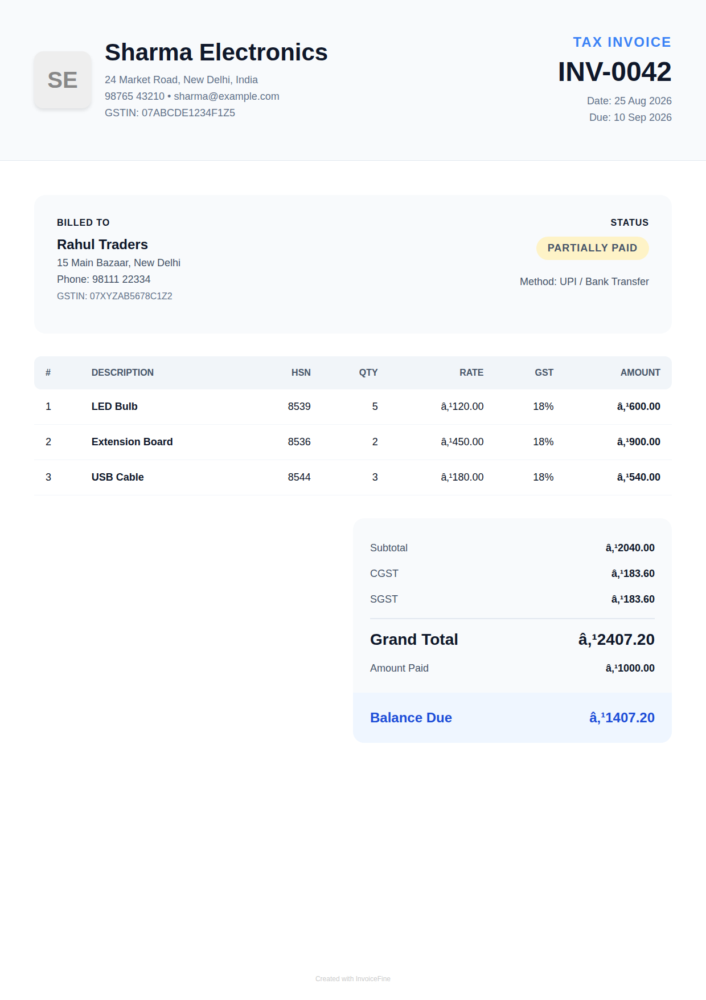 | PNG | 1240 × 1754 (A4) | [`assets/templates/modern.png`](assets/templates/modern.png) |
| **Premium Template** |  | PNG | 1240 × 1754 (A4) | [`assets/templates/premium.png`](assets/templates/premium.png) |
| **Professional Template** | 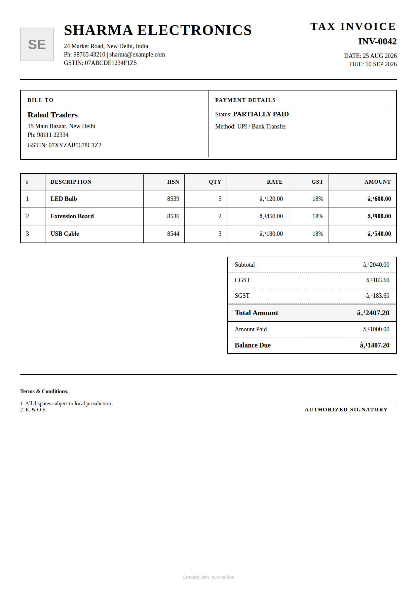 | PNG | 1240 × 1754 (A4) | [`assets/templates/professional.png`](assets/templates/professional.png) |

---

## 5. Desktop Application Screenshots

| Screen | Preview | Format | Dimensions | File Path |
|---|---|---|---|---|
| **Dashboard Overview** |  | PNG | 1024 × 640 | [`assets/screenshots/desktop/desktop-dashboard.png`](assets/screenshots/desktop/desktop-dashboard.png) |
| **Invoices Management** | 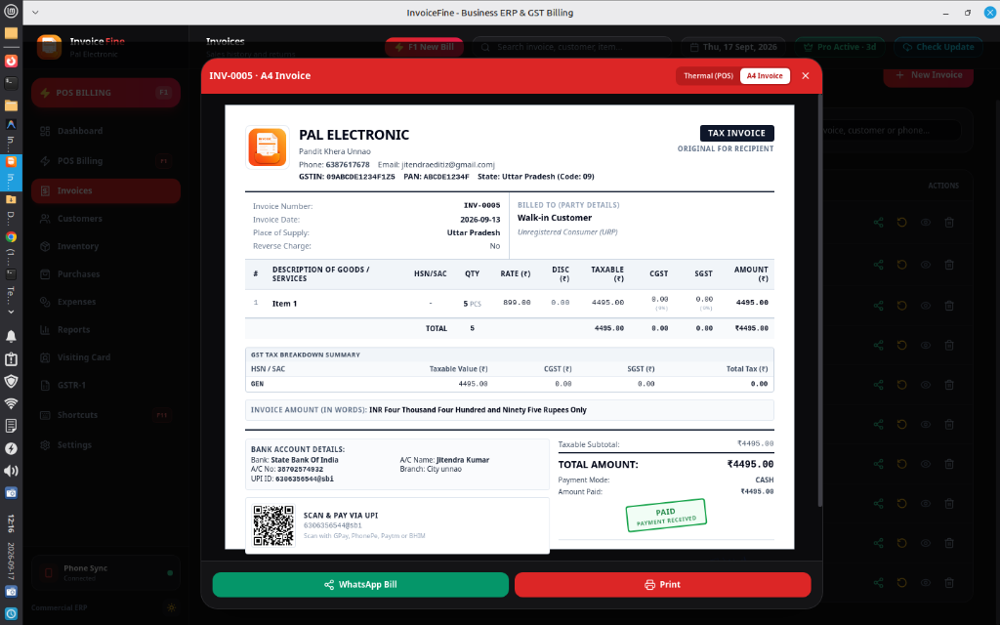 | PNG | 1024 × 640 | [`assets/screenshots/desktop/desktop-invoices.png`](assets/screenshots/desktop/desktop-invoices.png) |
| **POS Counter Billing** | 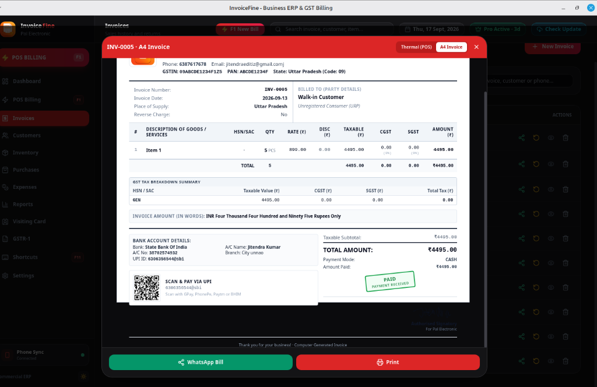 | PNG | 1024 × 664 | [`assets/screenshots/desktop/desktop-billing-pos.png`](assets/screenshots/desktop/desktop-billing-pos.png) |
| **Inventory Catalog** |  | PNG | 1024 × 653 | [`assets/screenshots/desktop/desktop-inventory.png`](assets/screenshots/desktop/desktop-inventory.png) |
| **Item Stock Movement Ledger** |  | PNG | 1024 × 669 | [`assets/screenshots/desktop/desktop-stock-ledger.png`](assets/screenshots/desktop/desktop-stock-ledger.png) |
| **Customer Sales Breakdown** |  | PNG | 1024 × 653 | [`assets/screenshots/desktop/desktop-customer-sales.png`](assets/screenshots/desktop/desktop-customer-sales.png) |

---

## 6. Mobile Application Screenshots

| Screen | Preview | Format | Dimensions | File Path |
|---|---|---|---|---|
| **Mobile Welcome** |  | PNG | 1024 × 1536 | [`assets/screenshots/mobile/mobile-welcome.png`](assets/screenshots/mobile/mobile-welcome.png) |
| **Mobile Features** |  | PNG | 1024 × 1536 | [`assets/screenshots/mobile/mobile-features.png`](assets/screenshots/mobile/mobile-features.png) |
| **Mobile Ready to Bill** |  | PNG | 1024 × 1536 | [`assets/screenshots/mobile/mobile-ready.png`](assets/screenshots/mobile/mobile-ready.png) |
| **Mobile UI View 1** |  | PNG | 1024 × 1536 | [`assets/screenshots/mobile/mobile-screen-1.png`](assets/screenshots/mobile/mobile-screen-1.png) |
| **Mobile UI View 2** |  | PNG | 1224 × 1285 | [`assets/screenshots/mobile/mobile-screen-2.png`](assets/screenshots/mobile/mobile-screen-2.png) |
| **Mobile UI View 3** | 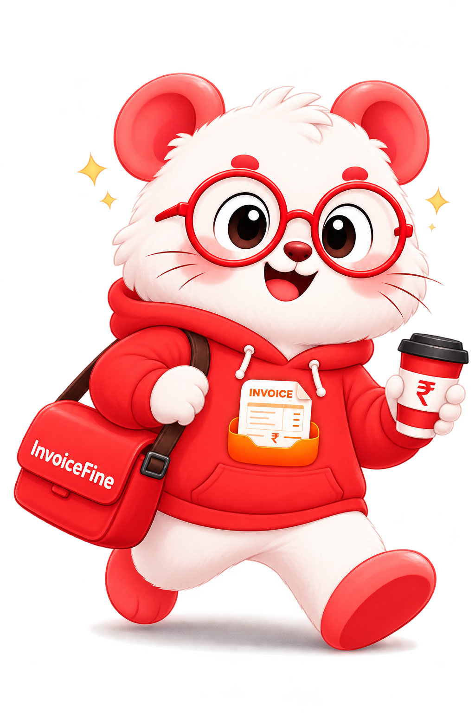 | PNG | 1024 × 1536 | [`assets/screenshots/mobile/mobile-screen-3.png`](assets/screenshots/mobile/mobile-screen-3.png) |
| **Mobile UI View 4** |  | PNG | 1330 × 1182 | [`assets/screenshots/mobile/mobile-screen-4.png`](assets/screenshots/mobile/mobile-screen-4.png) |
| **Mobile UI View 5** | 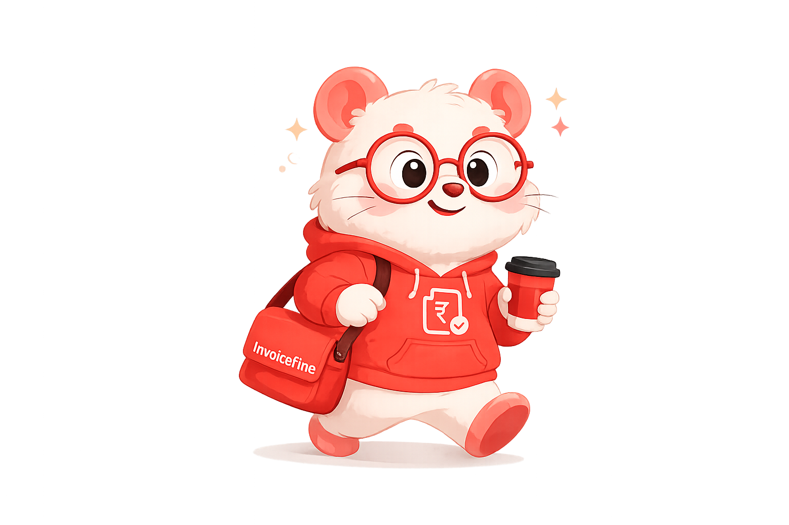 | PNG | 1536 × 1024 | [`assets/screenshots/mobile/mobile-screen-5.png`](assets/screenshots/mobile/mobile-screen-5.png) |

---

## Usage Guidelines & Brand Permissions
All assets listed above are property of **PRO CSC TOOLS**. Press, partners, and media contributors may use these official assets to review, present, or feature InvoiceFine in editorial coverage without alteration to colors or typography.
