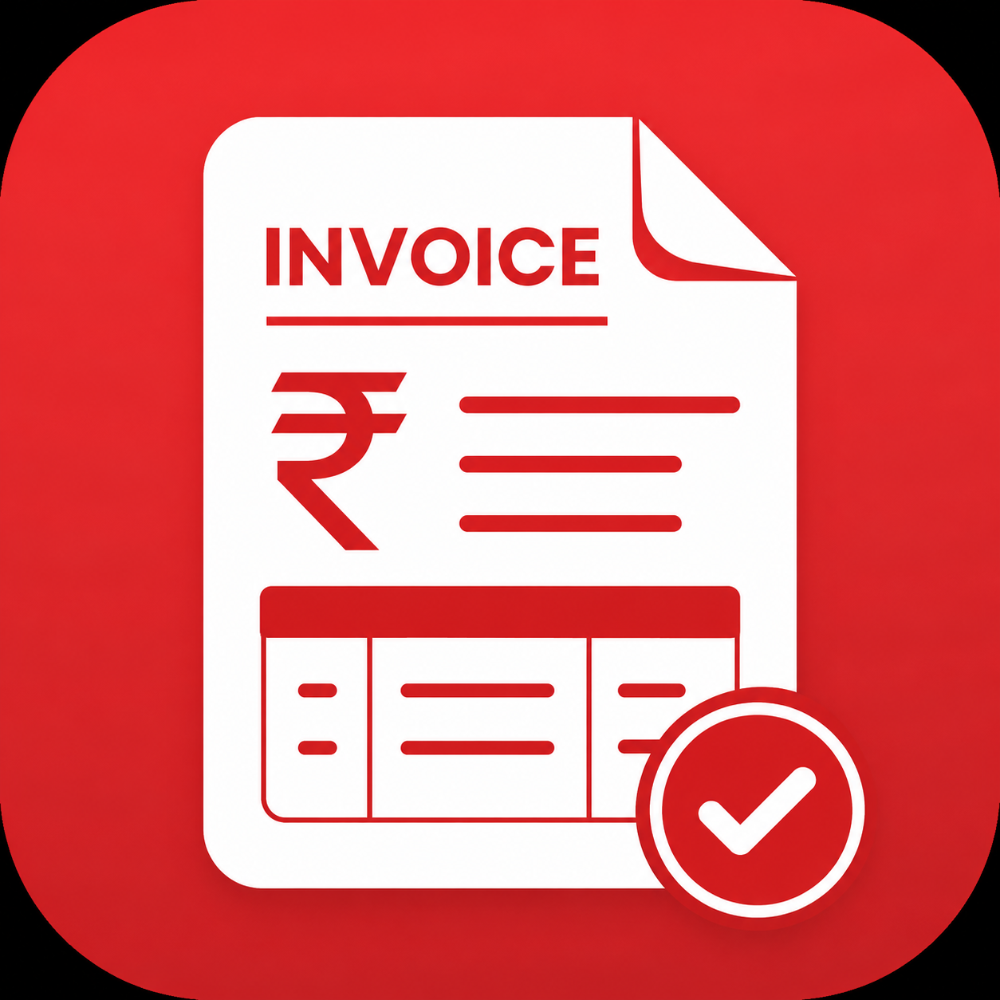

# InvoiceFine for Android

**InvoiceFine Mobile** brings full-featured GST billing, inventory management, customer khata, and expense tracking straight to your Android smartphone or tablet.

Designed for business owners, retail shopkeepers, and field professionals who need fast, portable, and reliable billing without being tied to a computer desk.

---

## Overview

| Attribute | Details |
|---|---|
| **App Name** | InvoiceFine |
| **Platform** | Android 8.0 (Oreo) and above |
| **Developer** | PRO CSC TOOLS |
| **Current Version** | `1.1.1` |
| **Category** | Business / Finance / Point of Sale |
| **Connectivity** | 100% Offline-capable |
| **Download Link** | `YOUR_GOOGLE_PLAY_STORE_URL` *(Placeholder — pending Play Store link)* |

---

## Tailored for Small Businesses

InvoiceFine for Android is designed to serve a broad range of micro, small, and medium businesses:
- **Retail & Grocery Stores**: Kirana stores, supermarkets, FMCG retailers.
- **Hardware & Electrical**: Electronic spares, appliance sales, sanitaryware.
- **Mobile & Computer Repair**: Repair shops, service centers, accessory dealers.
- **Apparel & Footwear**: Boutiques, readymade garment shops, shoe stores.
- **Consultants & Freelancers**: Professional service providers, technicians, agencies.
- **Wholesalers & Distributors**: On-field order taking and van sales delivery.

---

## Key Mobile Capabilities

### ⚡ Rapid Mobile Invoicing
- Create professional invoices in under 30 seconds.
- Scan item barcodes instantly using your phone’s built-in camera.
- Select from 5 built-in invoice styles: *Classic*, *Modern*, *Compact*, *Professional*, and *Premium*.
- Add business logo, bank account details, UPI QR code, and custom terms & conditions.

### 🖨️ Wireless Bluetooth Thermal Printing
- Pair directly with standard 58mm (2-inch) and 80mm (3-inch) portable Bluetooth thermal receipt printers.
- Print instant, inkless receipts for walk-in customers at checkout counters.
- Supports ESC/POS standard commands compatible with most commercial thermal printers.

### 📲 One-Tap WhatsApp Delivery
- Send invoices, payment receipts, and outstanding reminders directly to customer WhatsApp numbers.
- No need to save temporary numbers to your phone contacts.

### 📒 Pocket Khata & Ledger
- Keep track of credit customers and pending balances wherever you go.
- Record payments received (Cash, UPI, Cheque, Online) with automatic receipt generation.
- Review historical purchases for each customer directly during conversations.

### 📦 Mobile Inventory & Low-Stock Alerts
- View stock levels on your phone in real time.
- Instant alerts for items reaching low-stock thresholds.
- Quick stock addition and cost adjustment while receiving supplier deliveries.

---

## Subscription & Plans

InvoiceFine is free to download and provides access to essential billing features:

- **Free Tier**: Complete access to GST and non-GST billing, customer records, and inventory tracking with standard daily document limits. Ideal for micro-merchants and new startups.
- **Pro Tier**: Removes daily billing limits, unlocks priority templates, provides enhanced reporting, and enables advanced data capabilities.

Subscriptions can be managed securely through Google Play In-App Billing.

---

## Installation & Setup

1. **Download**: Install InvoiceFine from the Google Play Store or download verified installation packages.
2. **Business Profile Setup**: Enter your business name, phone number, address, and GSTIN (if applicable).
3. **Upload Logo & UPI**: Add your business logo and payment QR code to appear on printed and PDF invoices.
4. **Add Items**: Input your initial products or services manually or import via CSV.
5. **Start Billing**: Tap **New Invoice** to generate your first bill.

---

## Mobile Screenshots

  
  
  

  
  

---

## Support & Feedback

Encountering an issue or have a feature request for the Android app?
- **Email**: [procsctools@gmail.com](mailto:procsctools@gmail.com)
- **Help Center**: See [SUPPORT.md](SUPPORT.md)
