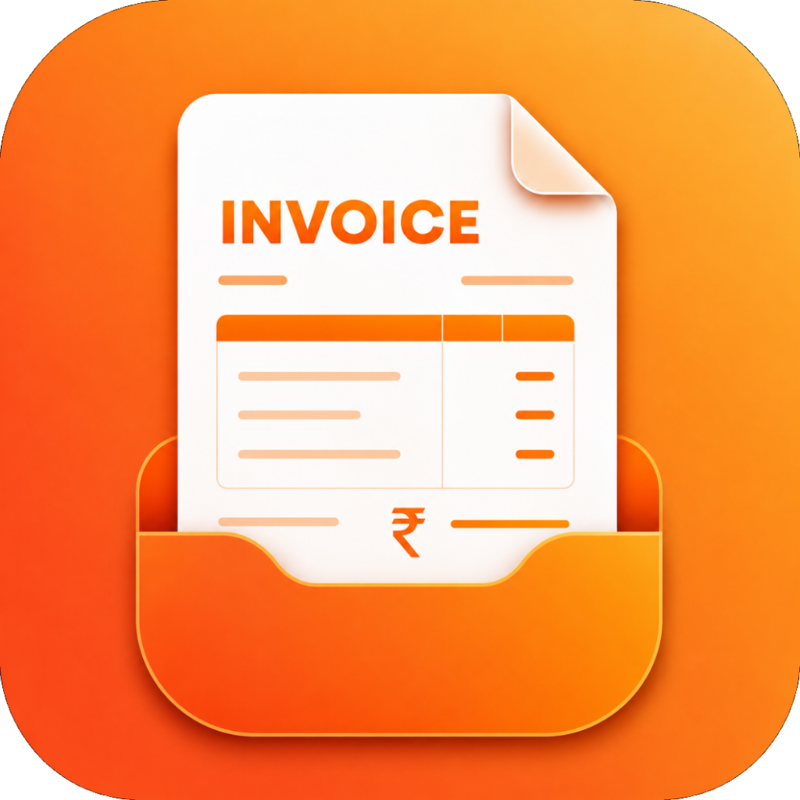
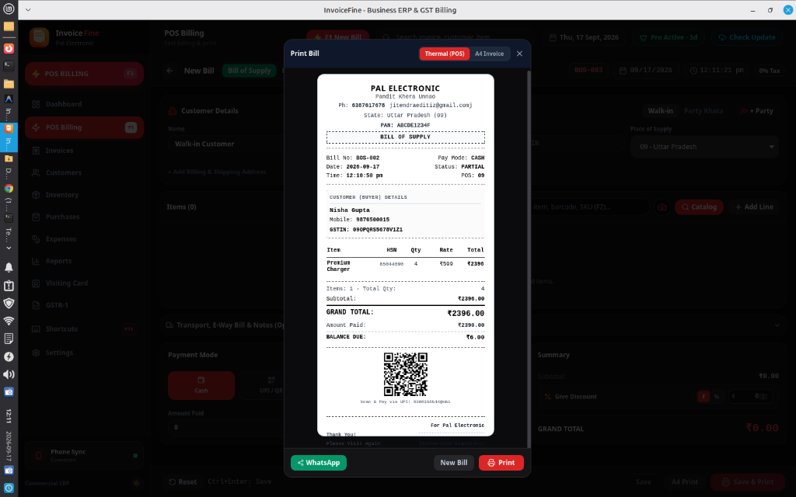
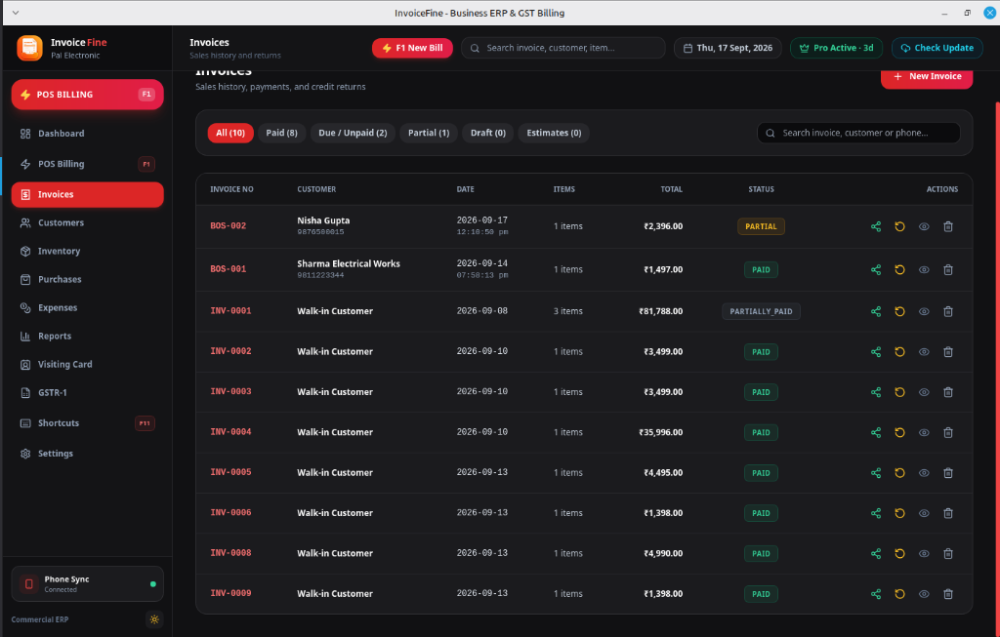
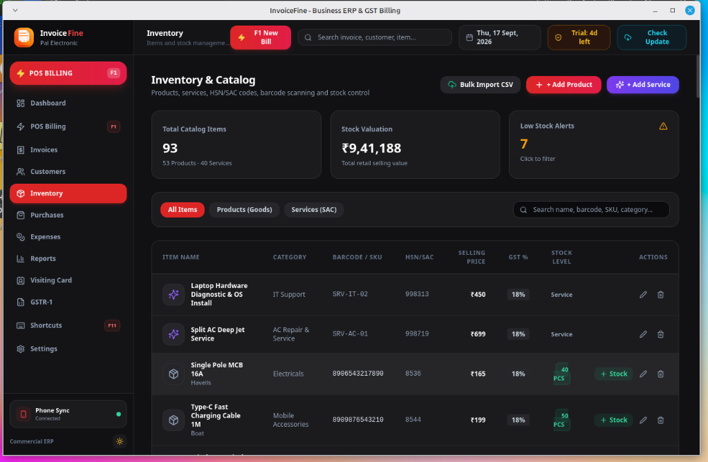
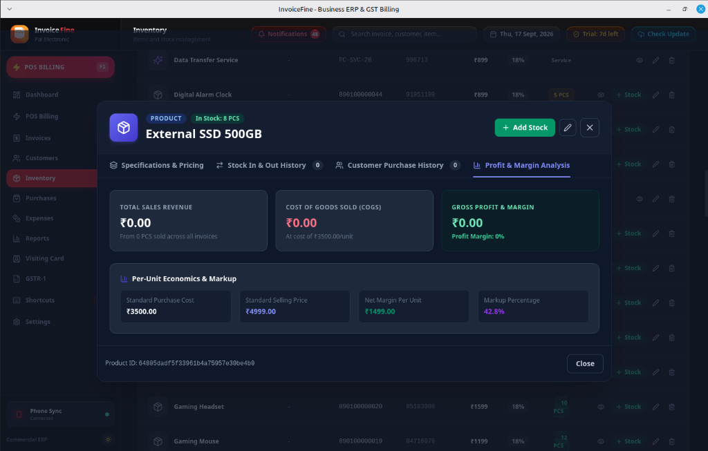
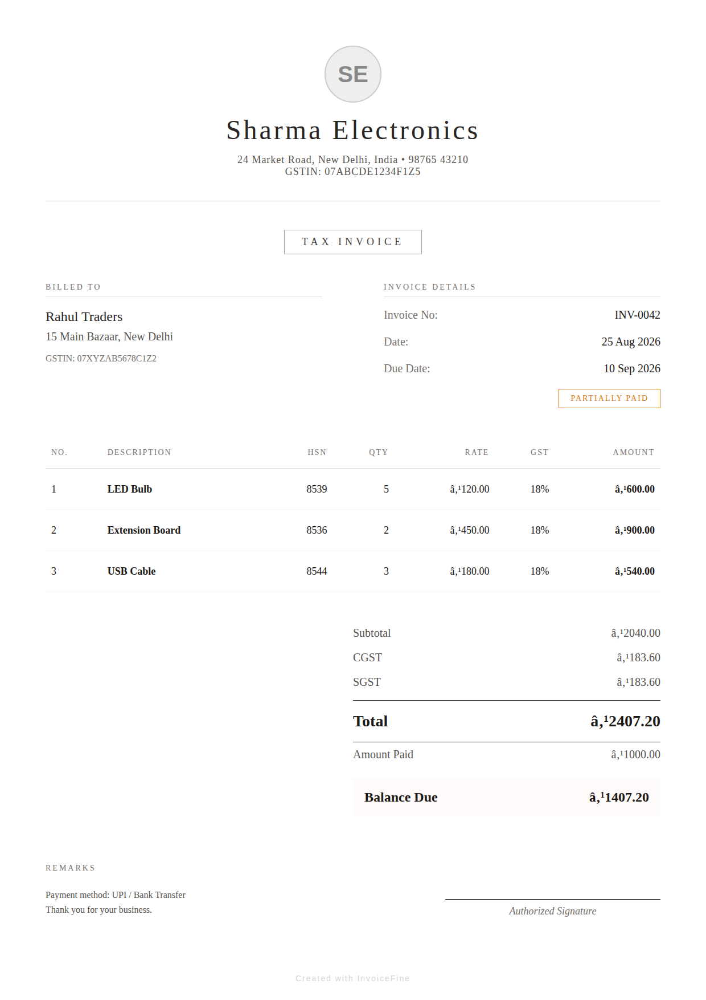

# InvoiceFine

**Smart Billing, Inventory & Business Management for Small Enterprises**

*Fast Invoicing • Real-time Stock Tracking • Customer Khata Ledger • Dual-Format Printing*

---

## Quick Navigation

| [Downloads](DOWNLOADS.md) | [Releases](RELEASES.md) | [Features](FEATURES.md) | [Mobile App](MOBILE-APP.md) | [Desktop App](DESKTOP-APP.md) |
|---|---|---|---|---|
| [Screenshots](SCREENSHOTS.md) | [Videos](VIDEOS.md) | [Media Assets](MEDIA-ASSETS.md) | [FAQ](FAQ.md) | [Support](SUPPORT.md) |

---

## About InvoiceFine

**InvoiceFine** is an all-in-one business management and billing solution crafted specifically for retail shops, wholesalers, service providers, freelancers, and small enterprises. It simplifies everyday commercial workflows into a seamless, modern experience.

Whether generating quick GST or non-GST bills on a mobile phone during rush hours, or managing comprehensive stock inventories and customer ledgers on a Linux desktop workstation, InvoiceFine delivers fast, accurate, and completely offline-capable business control.

---

## Core Capabilities

- **GST & Non-GST Invoicing**: Generate professional tax invoices (CGST, SGST, IGST) or non-tax cash memos in seconds.
- **Inventory & Stock Ledger**: Maintain item catalog, tracks quantity additions, sales deductions, low-stock warnings, and purchase histories.
- **Customer & Supplier Khata**: Track pending dues, payment settlements, transaction ledgers, and automated payment reminders.
- **Dual-Format Printing**: Seamless support for 58mm / 80mm thermal POS receipt printers and standard A4 laser/inkjet printers.
- **Instant Document Sharing**: Share PDF invoices, estimates, and payment receipts via WhatsApp, Email, or standard system share.
- **Expense & Cash Flow Tracking**: Record operational expenses, track profitability, and review daily/monthly sales performance.
- **Offline-First Reliability**: Operates entirely offline with zero mandatory cloud dependencies for daily billing.
- **Multi-Device Data Mobility**: Seamless backup and restore functionality to keep desktop and mobile records synchronized.

---

## Application Availability

### 📱 InvoiceFine for Android
Designed for counter billing, field sales, mobile technicians, and on-the-go billing.
- **Distribution**: Google Play Store / Direct Install
- **Highlights**: One-tap billing, camera barcode scanner, thermal Bluetooth printing, instant WhatsApp receipt sharing.
- [Explore Mobile App Details →](MOBILE-APP.md)

### 💻 InvoiceFine Desktop for Linux
Engineered for dedicated billing counters, multi-item wholesale desks, and back-office management.
- **Current Version**: `1.2.0`
- **Supported Formats**: `.deb` (Debian/Ubuntu/Mint), `.rpm` (Fedora/RHEL/openSUSE), and portable Linux AppImage (planned).
- **Highlights**: Full keyboard shortcuts, high-volume inventory management, comprehensive stock ledger modal, desktop USB/Network thermal printing.
- [Explore Desktop App Details →](DESKTOP-APP.md)

---

## Download Center

| Platform | Package Format | Target OS | Link |
|---|---|---|---|
| **Linux (64-bit)** | `.deb` (Debian Package) | Ubuntu 20.04+, Debian 11+, Linux Mint | [Download .deb](downloads/linux/InvoiceFine_1.2.0_amd64.deb) |
| **Linux (64-bit)** | `.rpm` (Red Hat Package) | Fedora 36+, RHEL, openSUSE | [Download .rpm](downloads/linux/InvoiceFine-1.2.0-1.x86_64.rpm) |
| **Linux (64-bit)** | `.AppImage` | Universal Linux Distribution | *Coming Soon* |
| **Android** | Google Play Store | Android 8.0 (Oreo) and above | [Get on Google Play](DOWNLOADS.md#android-app) |

*For full installation instructions, checksums, and previous versions, see [DOWNLOADS.md](DOWNLOADS.md).*

---

## Screenshots Preview

### Desktop Application

  
  

  
  

### Mobile Application

  
  
  
  

*View the complete gallery in [SCREENSHOTS.md](SCREENSHOTS.md).*

---

## Video Demonstrations & Tutorials

Learn how to get started, set up your business profile, generate your first invoice, and configure thermal printers.

- **Product Overview & Walkthrough**: [Watch in VIDEOS.md](VIDEOS.md#product-overview)
- **Linux Desktop Installation Guide**: [Watch in VIDEOS.md](VIDEOS.md#desktop-app-demo)
- **Thermal Printer Setup (58mm / 80mm)**: [Watch in VIDEOS.md](VIDEOS.md#printing-demo)

---

## Documentation Directory

- 📖 **[Features Guide (FEATURES.md)](FEATURES.md)**: Detailed breakdown of GST calculations, inventory tracking, reports, and templates.
- 📱 **[Mobile App Guide (MOBILE-APP.md)](MOBILE-APP.md)**: Android setup, printer configuration, and mobile workflows.
- 💻 **[Desktop App Guide (DESKTOP-APP.md)](DESKTOP-APP.md)**: Installation commands, package setup, updating, and troubleshooting.
- 📦 **[Releases & History (RELEASES.md)](RELEASES.md)**: Release highlights, version notes, and historical packages.
- 🎨 **[Media & Branding Assets (MEDIA-ASSETS.md)](MEDIA-ASSETS.md)**: High-resolution logos, banners, and app icons.
- ❓ **[Frequently Asked Questions (FAQ.md)](FAQ.md)**: Common questions regarding GST, offline usage, data privacy, and printing.
- 🔒 **[Privacy Information (PRIVACY.md)](PRIVACY.md)**: Offline data policy, local storage architecture, and data control.
- 🛟 **[Support & Inquiries (SUPPORT.md)](SUPPORT.md)**: Contact channels, bug reporting, and feature suggestions.
- 📜 **[License Terms (LICENSE.md)](LICENSE.md)**: Public terms of use and intellectual property declaration.

---

## Official Links & Channels

- **Official Developer / Publisher**: PRO CSC TOOLS
- **Official Support Email**: [procsctools@gmail.com](mailto:procsctools@gmail.com)
- **Google Play Store**: `YOUR_GOOGLE_PLAY_STORE_URL` *(Link pending store publication)*
- **Official Website**: `YOUR_OFFICIAL_WEBSITE_URL` *(Coming Soon)*
- **GitHub Release Hub**: [RELEASES.md](RELEASES.md)

---

  © InvoiceFine. Developed by PRO CSC TOOLS. All rights reserved.

